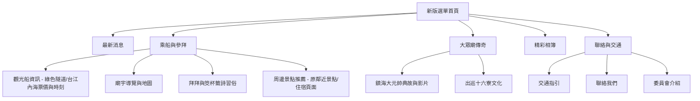

# 四草大眾廟選單架構（資訊架構）精簡與優化提案

目前四草大眾廟的官方選單過於冗長（有多達 10 個主分類），且層級過深（有些甚至需要點到第三層，如「旅遊景點 -> 鄰近住宿 -> 各家飯店名稱」），這在手機版畫面上是體驗的災難。

本提案旨在將複雜的選單**扁平化、直覺化**，將原有的 10 個主分類精簡為 **5 個核心分類**，讓遊客能在 3 秒內找到所需的熱門資訊（如船票、交通、拜拜習俗）。

---

## 一、 舊版選單問題分析

1.  **分類過多、定義重疊**：例如「最新消息」與「社群平台（媒體報導）」功能相似；「活動相簿」重複出現在多個地方。
2.  **層級過深（三層選單）**：手機用戶很難在狹窄的螢幕上精準點擊「第三層」的子項目。
3.  **選單內夾帶廣告與過期公告**：例如主選單的最後一項「活動相簿 -> 大同里鎮安宮重建（兄弟廟）...」其實是一則特定的新聞公告，不應該被當作永久性的網站主選單項目。
4.  **社交平台佔用過多選單空間**：FB、IG、LINE、YouTube 各佔一行，使選單變得非常擁擠。

---

## 二、 舊版選單架構圖（多達 10 個主分類，層級過深）

這張圖展示了目前網站的導航結構，可以明顯看到項目繁雜，且「鄰近住宿與景點」甚至深達三層，讓遊客點擊極為不便：

```mermaid
graph TD
    Root[舊版選單首頁] --> M1[首頁]
    Root --> M2[最新消息/活動]
    Root --> M3[關於我們]
    Root --> M4[400年傳奇-鎮海大元帥]
    Root --> M5[社群平臺]
    Root --> M6[觀光船資訊]
    Root --> M7[旅遊景點]
    Root --> M8[大眾廟玩什麼]
    Root --> M9[廟宇文化]
    Root --> M10[活動相簿]
    
    M3 --> M3_1[大眾廟簡介]
    M3 --> M3_2[委員會]
    M3 --> M3_3[交通資訊]
    M3 --> M3_4[聯絡我們]
    M3 --> M3_5[四草大眾廟導覽]
    
    M4 --> M4_1[台江風雲-鎮海大元帥]
    
    M5 --> M5_1[媒體報導]
    M5 --> M5_2[電視台/YOUTUBE]
    M5 --> M5_3[四草大眾廟粉專]
    M5 --> M5_4[四草大眾廟ig]
    M5 --> M5_5[四草大眾廟官方LINE]
    
    M6 --> M6_1[觀光船資訊]
    M6 --> M6_2[台江內海]
    M6 --> M6_3[綠色隧道]
    M6 --> M6_4[綠色隧道影片介紹]
    
    M7 --> M7_1[鄰近住宿]
    M7 --> M7_2[鄰近景點]
    
    M7_1 --> M7_1_1[夏都城旅]
    M7_1 --> M7_1_2[福爾摩沙遊艇酒店]
    M7_1 --> M7_1_3[台南安平樂雅軒酒店...]
    M7_1 --> M7_1_4[和逸飯店 / 歐薇汽車旅館 / 大員皇冠...]
    
    M7_2 --> M7_2_1[台江國家公園遊客中心]
    M7_2 --> M7_2_2[安順鹽場 / 抹香鯨陳列館...]
    M7_2 --> M7_2_3[四草砲台 / 正統鹿耳門聖母廟...]
    
    M8 --> M8_1[大眾廟玩什麼]
    M8 --> M8_2[台灣習俗-拜拜]
    M8 --> M8_3[台灣習俗-筊杯]
    M8 --> M8_4[台灣習俗-抽籤詩]
    M8 --> M8_5[活動相簿]
    
    M9 --> M9_1[出巡十六寮]
    M9 --> M9_2[其他文化活動]
    
    M10 --> M10_1[大同里鎮安宮重建贊助公告]
```

---

## 三、 新版「扁平化」選單架構提案（5 大主分類）

我們建議將主選單合併、簡化為以下 **5 個以遊客需求為導向** 的核心分類，且**所有分類最多只保留兩層**：

### 1. 最新消息 (News)
*   **整合內容**：合併原本的「最新消息/活動」與社群平台中的「媒體報導」。
*   **價值**：遊客想知道大眾廟最近有什麼祭典、活動或新聞，直接點這裡。

### 2. 乘船與參拜 (Visit Guide) ⭐【遊客最關心】
*   **整合內容**：合併原本的「觀光船資訊」與「大眾廟玩什麼」。
*   **子選單（僅限單層）**：
    *   **觀光船資訊**（綠色隧道、台江內海的票價、時刻表與乘船規則）
    *   **廟宇導覽與簡介**（大眾廟歷史、地圖導覽）
    *   **拜拜與筊杯籤詩習俗**（導引遊客如何參拜大眾廟、如何求籤）
    *   **周邊景點推薦**（點擊後進入一個精美網頁，介紹鄰近的台江國家公園、四草砲台，以及周邊合作的夏都城旅、福爾摩沙遊艇酒店等住宿。**列表放在網頁內容中，不在選單中展開**）。

### 3. 大眾廟傳奇 (Temple Culture)
*   **整合內容**：合併原本的「400年傳奇-鎮海大元帥」與「廟宇文化（出巡十六寮）」。
*   **價值**：收納大眾廟的歷史內涵、建廟傳奇影片，供對宗教文化有興趣的遊客深度閱讀。

### 4. 精彩相簿 (Gallery)
*   **整合內容**：將重複的相簿功能統一歸納至此，並移除「大同里鎮安宮重建」這種特定公告級別的選單（改為放入相簿分類中）。

### 5. 聯絡與交通 (Contact)
*   **整合內容**：合併「交通資訊」、「聯絡我們」、「委員會」。
*   **價值**：將功能性的資訊統一收納，維持版面乾淨。

---

## 三、 行動端（手機版）選單體驗優化建議

除了簡化選單的文字與架構，在**手機介面（UX）**上建議採用以下調整：

1.  **社群帳號「圖示化」**：
    不要再把 FB 粉絲專頁、IG、LINE、YouTube 當作文字選單排在選單中。建議**直接將它們轉化為小圓圈圖標**（如 FB 藍色圖示、LINE 綠色圖示），橫向一排排在手機側邊選單的最下方，既美觀、不佔空間又極具現代感。
2.  **手機端手風琴摺疊 (Accordion Menu)**：
    手機版側邊選單中，點擊第一層（例如「乘船與參拜」）時，應在下方平滑展開子項目，不可直接跳頁，避免使用者在深層的網頁中迷失方向。
3.  **取消第三層選單，改以「網頁內卡片」展示**：
    將原本的「鄰近住宿 -> 各大飯店名稱」從選單中刪除。當遊客點擊「周邊景點推薦」時，直接進入該網頁，網頁內部再用乾淨、可點選的卡片排列出各大飯店與鄰近景點的介紹，這才是最適合行動裝置的瀏覽方式。
